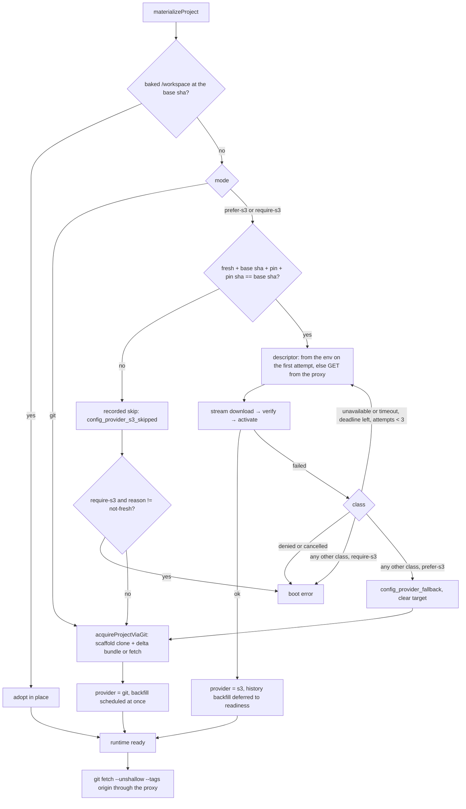
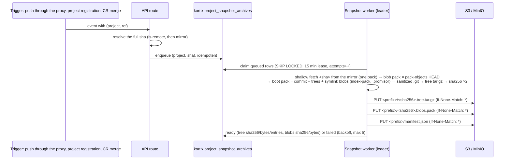

# Project snapshot archives (S3 config provider)

A fresh session materializes its project from a prebuilt `.tar.gz` in S3
instead of a Git clone through the proxy. The Git path stays intact as the
default and as the observable fallback.

## Architecture

```
API (leader worker)                              Sandbox (kortixd)
────────────────────                             ───────────────────────────────
push / import / merge / session-create miss      boot → config-provider coordinator
  → kortix.project_snapshot_archives (queued)      mode git        → warm adoption → Git (unchanged path)
  → build from the Git mirror at ONE sha           mode prefer-s3  → warm adoption → S3 → fallback Git
  → S3: <owner>/<repo>/<sha>/<repo-id>/            mode require-s3 → warm adoption → S3, fail closed
       project-snapshot-v2/
         <sha256>.tree.tar.gz   (boot object)    S3 = descriptor from the session env (presigned
         <sha256>.blobs.pack    (hydration)          at create; the Git-proxy route is the fallback)
       (If-None-Match, both) then manifest.json      → ONE GET of the tree object (no credential)
  → row ready                                        → sha256 + header guard on the stream → stage file
session create: ready row → env pin + descriptor     → native tar → verify → activate (partial clone)
  KORTIX_PROJECT_SNAPSHOT_PIN=sha:sha256:bytes       → runtime spawns; repo-materialized
  KORTIX_PROJECT_SNAPSHOT_DESCRIPTOR=base64 JSON     → OFF the boot path: index refresh, then
  (both objects presigned, 15 min; object checks       presigned GET of the blob pack → git index-pack
   run in the background, never on this path)
```

**Why two objects.** v1 shipped one tar.gz holding the working tree AND a full
pack: every blob twice, 2.5× the bytes of the Git delta bundle, and a JS
extraction. v2's boot object is the working tree plus a `.git` whose one pack
holds the commit, the trees and the symlink blobs only, marked promisor; the
box is a valid blob-less partial clone the moment `tar` finishes, and nothing
runs git on the boot path. The tip's blobs travel as a plain git pack the
daemon imports after activation. Until that lands, a command that needs an old
blob (`git diff` of a modified file, `git checkout -- file`, `git stash`,
`blame`, `log -p`) fetches it lazily through the proxy — slower, never
broken. `git status`, `add`, `commit`, `push` and the harness's project scan
need no blob (symlinks are the one exception git compares by blob content,
which is why their blobs ride in the boot pack).

| Piece | Where |
| --- | --- |
| Config | `apps/api/src/config.ts` `KORTIX_PROJECT_SNAPSHOT_*` |
| Storage client (AWS SDK, default credential chain, presign) | `apps/api/src/git-proxy/project-snapshot-store.ts` |
| Ledger + enqueue + build + publish | `apps/api/src/git-proxy/project-snapshot.ts` |
| Leader worker | `apps/api/src/git-proxy/project-snapshot-worker.ts` (started in `startSingletonWorkers`) |
| Descriptor route | `GET /v1/git/{project}.git/project-snapshot?sha=` in `apps/api/src/git-proxy/index.ts` |
| Env pin | `apps/api/src/projects/lib/session-runtime-env.ts` |
| Enqueue sites | registration (`project-registration.ts`), proxy push (`git-proxy/index.ts`), CR merge (`routes/r9.ts`), session-create miss (`lib/sessions.ts`) |
| Ledger table | `kortix.project_snapshot_archives` (migration `20260912214610636_project_snapshot_archives.sql`) |
| Supervisor coordinator | `apps/kortix-sandbox-agent-server/src/config-provider/config-provider.ts` |
| Supervisor transports | `config-provider/git/git-config-provider.ts`, `config-provider/s3/s3-config-provider.ts` |
| Operator tool | `apps/api/scripts/project-snapshot.ts` |
| Boot bench / compat gate | `apps/api/scripts/project-snapshot-bench.ts`, `apps/api/scripts/project-snapshot-compat.ts` |
| Local bench, no sandbox | `apps/kortix-sandbox-agent-server/scripts/config-provider-bench.ts` (+ `materialize-once.ts`): the daemon's coordinator on this machine, Git vs S3 per round, against the local API + MinIO; results in the benchmark runbook |

The boot object is the committed tree at one exact commit plus a sanitized
shallow `.git` (one commit, no remote, no hooks, no reflogs, fresh index, one
promisor-marked pack of commit + trees + symlink blobs). The blob pack is
`git pack-objects` of everything reachable from that commit. LFS objects are
NOT included (pointers only — same as the Git path without `git lfs`);
submodule contents are NOT included (`.gitmodules` only — same as a clone
without `--recurse-submodules`). A ledger row built as an older `format` is a
cache miss: the next enqueue re-queues it under the current format (its old
objects stay where they are; nothing is deleted).

After activation the workspace is a partial clone: `extensions.partialclone =
origin`, `remote.origin.promisor = true`, `remote.origin.partialclonefilter =
blob:none`. The deferred history backfill therefore fetches commits and trees
only; historical blobs are fetched on demand.

### How a fresh boot flows (`prefer-s3`, archive prepared)

```mermaid
sequenceDiagram
    autonumber
    participant C as Client
    participant API as Kortix API
    participant P as Sandbox provider
    participant D as kortixd (in the box)
    participant GP as Git proxy (API)
    participant S3 as S3 / MinIO

    C->>API: POST /projects/:id/sessions
    API->>API: mode = env or project metadata<br/>ledger: ready row for the base sha? → presign both objects (local signing)<br/>object check → background (re-queues the row for the NEXT session if gone)
    API->>P: create sandbox, env = KORTIX_TOKEN, KORTIX_REPO_URL (proxy),<br/>KORTIX_PROJECT_SNAPSHOT_MODE, KORTIX_PROJECT_SNAPSHOT_PIN=sha:sha256:bytes,<br/>KORTIX_PROJECT_SNAPSHOT_DESCRIPTOR=base64 {tree, blobs: presigned URL, sha256, bytes, expires_at}
    P-->>D: VM boots, daemon starts
    D->>D: warm check: baked /workspace already at the base sha? (no)
    D->>D: eligible: fresh session, base sha, pin present, pin sha == base sha
    D->>D: descriptor from the env: names the pin sha, ≥ 30 s of lifetime left → use it (first attempt only)
    Note over D,GP: only on a retry, an expired or refused (403) URL, or a missing env descriptor:<br/>GET /v1/git/<project>.git/project-snapshot?sha=<pin sha> (Authorization: KORTIX_TOKEN) → 200 {tree, blobs}
    D->>S3: GET tree object (presigned)
    S3-->>D: tar.gz stream
    D->>D: stream → stage FILE: sha256 + byte cap + inactivity watchdog;<br/>tar headers guarded on a tee (nothing written to the tree yet)
    D->>D: digest verified → native `tar -xzf` into the private stage (in-process fallback)
    D->>D: verify: marker, .git/config allowlist, promisor pack, rev-parse HEAD == sha
    D->>D: activate: rename stage → /workspace, origin = proxy URL, partial-clone config,<br/>session branch via branch + symbolic-ref (no checkout), git identity
    Note over D: mark repo-materialized (provider = s3). The runtime spawn ran in parallel.
    D->>D: off the boot path: git update-index --refresh
    D->>S3: GET blob pack (presigned)
    S3-->>D: pack stream → sha256 → git index-pack --stdin → .promisor mark
    Note over D: config_provider.hydration: pending → ok | failed (failed = lazy blob fetches through the proxy)
    D-->>API: runtime ready (health runtimeReady: true)
    D->>GP: git fetch --unshallow --tags origin (best effort, after hydration settles; blob-less)
    GP-->>D: history commits + trees (working tree unchanged)
```

Decisions and fallback inside the daemon:



The producer, on the API side:



## Configuration

API (`apps/api/.env*` via dotenvx, or the deployment's secret blob):

| Variable | Meaning |
| --- | --- |
| `KORTIX_PROJECT_SNAPSHOT_MODE` | `git` (default; rollback) / `prefer-s3` / `require-s3` (acceptance only) |
| `KORTIX_PROJECT_SNAPSHOT_S3_ACCELERATE` | `true` presigns sandbox downloads for `<bucket>.s3-accelerate.amazonaws.com` (S3 Transfer Acceleration): the box's TCP/TLS ends at the nearest AWS edge and the distance to the bucket rides AWS's backbone — a short first byte and fast loss recovery from any coast, no caching. Requires `transfer_acceleration = true` on the bucket module; ignored when a custom public endpoint (MinIO) is set; the API's own calls stay regional. About USD 0.04/GB extra |
| `KORTIX_PROJECT_SNAPSHOT_DOWNLOAD_TTL_SECONDS` | Presigned URL lifetime (900). A presigned URL is also bounded by the **credentials that signed it**: temporary credentials (an ECS task role, an `aws login` session) invalidate every URL they signed the moment they expire, whatever the TTL says. The SDK refreshes task-role credentials minutes before expiry, so a URL signed in that last window lives only until the rotation; a boot uses its URL within seconds and the daemon re-fetches a fresh descriptor on a refused URL, so this is safe — but a test API running on short-lived exported keys (15 min) will see every S3 boot fail once they lapse (observed 2026-09-15, `unavailable` at `download` on 12 consecutive rounds) |
| `KORTIX_PROJECT_SNAPSHOT_DESCRIPTOR` (sandbox env, set by the API) | base64 JSON of the proxy's descriptor body, presigned at session create (`KORTIX_PROJECT_SNAPSHOT_DOWNLOAD_TTL_SECONDS`, 900). The daemon uses it for its first attempt; a retry, an expired or refused URL, or a malformed value falls back to the proxy route. Health shows which one served: `config_provider.s3_descriptor: env \| proxy` |
| `KORTIX_PROJECT_SNAPSHOT_S3_BUCKET` | bucket; unset = producer idle, no S3 anywhere |
| `KORTIX_PROJECT_SNAPSHOT_S3_REGION` | region (falls back to `AWS_REGION`) |
| `KORTIX_PROJECT_SNAPSHOT_S3_PREFIX` | optional key prefix, e.g. `dev/` when environments share a bucket |
| `KORTIX_PROJECT_SNAPSHOT_S3_ENDPOINT` | S3-compatible endpoint override (MinIO). Unset on AWS |
| `KORTIX_PROJECT_SNAPSHOT_S3_PUBLIC_ENDPOINT` | endpoint the SANDBOX reaches, when it differs (MinIO behind a proxy/tunnel). Unset on AWS |
| `KORTIX_PROJECT_SNAPSHOT_S3_FORCE_PATH_STYLE` | `true` for MinIO |
| `KORTIX_PROJECT_SNAPSHOT_S3_ACCESS_KEY_ID` / `_SECRET_ACCESS_KEY` | explicit pair; unset = AWS SDK default chain (task role) |
| `KORTIX_PROJECT_SNAPSHOT_DOWNLOAD_TTL_SECONDS` | presigned URL lifetime (default 900) |
| `KORTIX_PROJECT_SNAPSHOT_MAX_ARCHIVE_BYTES` | producer cap (default 512 MiB) |

Per-project canary override: `projects.metadata.project_snapshot_mode`
(`git` / `prefer-s3` / `require-s3`) wins over the platform mode for that
project's fresh sessions.

Required S3 permissions for the API principal, on the bucket/prefix:
`s3:PutObject`, `s3:GetObject`, `s3:ListBucket` (HeadObject). Conditional
writes (`If-None-Match: *`) need no extra permission. The sandbox needs NO
credential: it receives a presigned GET only.

Recommended bucket policy: private, versioning off, a lifecycle rule expiring
objects after N days (revisions are immutable and rebuildable; the ledger row
is the readiness truth — an expired object shows up as `missing` → Git
fallback and the row can be re-queued with `retry`).

## Local development (MinIO)

```sh
docker run -d --name kortix-project-snapshot-minio -p 127.0.0.1:19100:9000 \
  -e MINIO_ROOT_USER=kortixsnapshot -e MINIO_ROOT_PASSWORD=kortixsnapshotsecret \
  quay.io/minio/minio:RELEASE.2025-09-07T16-13-09Z server /data
```

`apps/api/.env.local` (gitignored):

```
KORTIX_PROJECT_SNAPSHOT_MODE=prefer-s3
KORTIX_PROJECT_SNAPSHOT_S3_BUCKET=kortix-project-snapshots
KORTIX_PROJECT_SNAPSHOT_S3_REGION=us-east-1
KORTIX_PROJECT_SNAPSHOT_S3_ENDPOINT=http://127.0.0.1:19100
KORTIX_PROJECT_SNAPSHOT_S3_FORCE_PATH_STYLE=true
KORTIX_PROJECT_SNAPSHOT_S3_ACCESS_KEY_ID=kortixsnapshot
KORTIX_PROJECT_SNAPSHOT_S3_SECRET_ACCESS_KEY=kortixsnapshotsecret
# cloud sandboxes must reach MinIO: `cloudflared tunnel --url http://127.0.0.1:19100`
KORTIX_PROJECT_SNAPSHOT_S3_PUBLIC_ENDPOINT=https://<quick-tunnel>.trycloudflare.com
```

Then `dotenvx run --ignore=MISSING_ENV_FILE -f .env.local -f .env -- bun run scripts/project-snapshot.ts ensure-bucket`.

### Prove the object-store calls on the image's Bun

`apps/api/Dockerfile` pins `BUN_VERSION=1.2` (1.2.23) while laptops and CI run
a newer Bun. `scripts/project-snapshot-s3-probe.ts` exercises the exact SDK
call shapes the store uses and prints one JSON line with `ok`. Run it inside
the image's Bun before touching `project-snapshot-store.ts` or bumping the SDK:

```sh
# from the repo root; Docker Desktop: use the MinIO container's bridge IP as S3_ENDPOINT
docker run --rm -v "$PWD:$PWD:ro" -w "$PWD/apps/api" \
  -e S3_ENDPOINT=http://$(docker inspect -f '{{.NetworkSettings.IPAddress}}' kortix-project-snapshot-minio):9000 \
  oven/bun:1.2-slim bun run scripts/project-snapshot-s3-probe.ts
# → {"ok":true,"bun":"1.2.23","buffer_put_ms":15,"conditional_put_duplicate":"PreconditionFailed/412",…}
```

Known: on Bun 1.2.23 a `PutObject` whose `Body` is a Node `createReadStream`
never completes and pins a core (verified 2026-09-13; a Buffer body of the
same 3 MiB finishes in 15–30 ms). The store therefore uploads the archive as a
whole-file Buffer. Keep it that way, or re-run the probe with the new shape.

The daemon side has the same class of gap: `kortix-agent` is compiled with
`SANDBOX_AGENT_BUN_VERSION=1.3.11`, whose `fetch` re-issues a GET after a
mid-body socket reset and appends the second response to the same body
stream (Bun 1.4 delivers a clean short EOF). Run the coordinator suite under
that Bun before changing `s3-config-provider.ts`:

```sh
# from apps/kortix-sandbox-agent-server; needs git inside the image
docker run --rm -v "$PWD:/app:ro" -w /tmp oven/bun:1.3.11 sh -c \
  'cp -r /app /w && cd /w && apt-get update -qq && apt-get install -y -qq git >/dev/null \
   && git config --global user.email t@t.test && git config --global user.name t \
   && bun install --frozen-lockfile && bun test src/__tests__/config-provider.test.ts'
```

(pnpm-managed checkouts: copy without `node_modules`; `bun install` restores
the daemon's own lockfile.) Expected: 22 pass, 0 fail.

## AWS

Terraform owns the bucket and the task-role grant; the deploy workflow owns
the non-secret env that names the bucket. Nothing else is needed: no sandbox
credential, no public endpoint override (the bucket's regional endpoint is
what the presigned URLs point at), no KMS context unless you opt in.

| Piece | Where |
| --- | --- |
| Bucket module | `infra/terraform/modules/project-snapshots-bucket` — private (all public access blocked, `BucketOwnerEnforced`), SSE-S3 by default (`kms_key_arn` switches to SSE-KMS), versioning on with 7-day noncurrent expiry, objects expire after `expiration_days` (default 30; 0 disables), incomplete multipart uploads aborted after 1 day, TLS-only bucket policy |
| Task-role grant | `modules/ecs-api` `project_snapshot_bucket_arn` (+ `project_snapshot_kms_key_arn`): `s3:PutObject` + `s3:GetObject` on `<bucket>/*`, nothing on the bucket itself, no delete |
| Wiring | `infra/terraform/environments/{dev,staging,prod,prod-us-east-2-shadow}/main.tf`: `module "project_snapshots"` named `kortix-<env>-project-snapshots`, passed into `module "api"`; output `project_snapshot_bucket` |
| Env | `KORTIX_ECS_ENV_OVERRIDES` in `.github/workflows/deploy-<env>.yml`: `KORTIX_PROJECT_SNAPSHOT_S3_BUCKET` = the bucket name, `KORTIX_PROJECT_SNAPSHOT_S3_REGION` = the root's `aws_region`. Set for **dev and staging** (`kortix-dev-project-snapshots`, `kortix-staging-project-snapshots`; prod and the shadow root have the bucket but no env yet) as of this branch; dev and prod get the bucket and the grant from Terraform but stay idle until their workflows name it |

Bringing an environment up (dev first — `main` auto-deploys it — then staging;
the steps are the same with `dev` in place of `staging`):

1. Apply `infra/terraform/environments/<env>` (the usual `terraform-apply.yml`
   dispatch for that root). Plan shows: one bucket + its five sub-resources,
   one `aws_iam_role_policy` on `kortix-<env>-task`, one output. Nothing
   touches the running service. Order does not matter: a deploy that names a
   bucket which does not exist yet leaves the worker logging failed uploads
   and every session on the Git path until the apply lands.
2. Deploy (`deploy-<env>.yml`). `ecs-deploy.sh` merges the two new
   keys into the task env; the API validates them at boot and the leader's
   snapshot worker starts polling. `GET /v1/git/<project>.git/project-snapshot`
   answers 404 `not_prepared` instead of 503 from here on.
3. Prepare one project and check it landed:
   `bun run scripts/project-snapshot.ts prepare <project> --wait` (through the
   staging env, or `backfill`), then `status <project>` → `ready`,
   `format: project-snapshot-v2`, `tree_object` / `blobs_object` /
   `manifest_object` present. `aws s3 ls s3://kortix-staging-project-snapshots/`
   shows the prefix.
4. Canary as in "Rollout" below; the box's `config_provider` must show
   `provider: s3`, `s3_extractor: tar`, `hydration.status: ok`, and the
   in-guest `s3_acquire` timing is the number the local benchmark could not
   produce.

### Previews (the `preview` label)

Previews stay on the **Git path**. A preview API runs inside a sandbox from the
self-host Compose bundle, next to code from the pull request, and the preview
pipeline holds **no cloud identity** by contract
(`infra/scripts/test-ecs-preview-runtime.py`
`test_the_preview_pipeline_holds_no_cloud_or_delivery_identity`,
`tests/unit/web-ecs-workflow.test.ts`). `AWS_*` is outside the runtime-secret
allowlist in `tests/src/core/preview-stack.ts`, so the preview API never names a
bucket, validates it as optional, and `GET …/project-snapshot` answers 503.

| Piece | Where |
| --- | --- |
| Providers | the stack offers `daytona,platinum` when `PLATINUM_API_KEY` is present (Daytona stays the default for unpinned sessions; pin `{"provider":"platinum"}` on create to test Platinum) |
| S3 path | not exercised on previews; verify it locally (MinIO, above) and on dev/staging |

Exercising S3 on previews needs a decision to change that contract first — for
example a MinIO service inside the preview Compose bundle, which keeps the
pipeline free of AWS credentials.

Expiry semantics: objects are derived data, so `expiration_days` is safe.
Both the descriptor route and the session-create pin lookup HEAD both objects;
a missing one re-queues the ledger row (`lastError: published … is no longer in
the bucket; re-queued`) and the session takes the Git path. The rebuild is
deterministic, so when the manifest outlived its objects the worker republishes
them under the same keys; a differing digest stops the build loudly. The
`project-snapshot-v1/` prefixes from the first cut are never read again and
expire with everything else.

Cost: two HeadObject calls per fresh session on the API side (~10 ms in-region).

## Preparation, backfill, readiness

All commands run from `apps/api` through the API env
(`dotenvx run --ignore=MISSING_ENV_FILE -f .env.local -f .env -- bun run scripts/project-snapshot.ts …`).

| Command | Effect |
| --- | --- |
| `prepare <projectId> [--ref main] [--sha <40hex>] [--wait]` | resolve the tip (or pin an exact sha), queue it, optionally build inline and print the verified status |
| `status <projectId> [--sha <40hex>]` | ledger row (incl. `format`) + HeadObject on the tree object and the blob pack + manifest presence; exit 0 only when ready at the current format and all three objects exist |
| `retry <projectId> --sha <40hex>` | re-queue a failed/stuck row |
| `backfill [--limit 50] [--wait]` | queue the default-branch tip of every active project without a ready row (default branches only) |
| `worker-once` | one worker pass in this process |

Automatic enqueue happens on project registration/import, on every successful
push through the Git proxy (tip read with `ls-remote`), on a change-request
merge (exact merged sha), and on a session-create cache miss (the next session
finds it). The leader worker claims rows with `FOR UPDATE SKIP LOCKED`,
retries transient failures 5× with 30 s·2ⁿ backoff (cap 1 h), never
overwrites a published object, and never flips a row to `ready` before both
objects are verified in the bucket.

## Observability

Sandbox (`GET /kortix/health` → `config_provider`):

```json
{"mode":"prefer-s3","provider":"s3","expected_sha":"…","actual_sha":"…","sha_matches":true,
 "s3_attempted":true,"s3_attempts":1,"s3_failed":false,"s3_stage":null,"s3_reason":null,
 "fallback":false,"total_ms":3517,"timings":{"warm":5,"s3_acquire":3479,"s3_activate":31},"outcome":"ok"}
```

A successful Git fallback keeps the S3 failure visible: `s3_failed:true`,
`s3_stage`, `s3_reason` (`missing` | `denied` | `expired-authorization` |
`unavailable` | `timeout` | `malformed` | `digest-mismatch` |
`revision-mismatch` | `limit-exceeded` | `no-pin` | …), `fallback:true`.

Daemon log events: `config_provider_s3_failed` (stage, reason, attempts,
duration, expected sha), `config_provider_fallback`, `config_provider_complete`
(provider, actual sha, per-stage timings), `config_provider_sha_drift`.
Presigned URLs are never logged.

Boot timeline marks relayed to `kortix.provider_events` (kind `boot`):
`config-provider:s3:ok`, `config-provider:s3:failed:<reason>`,
`config-provider:fallback`, `config-provider:git:ok`,
`config-provider:git:fallback`, `config-provider:warm`. Aggregate S3
success/failure/fallback counts and the fallback rate:

```sql
select
  count(*) filter (where marks @> '[{"label":"config-provider:s3:ok"}]')       as s3_ok,
  count(*) filter (where marks::text like '%config-provider:s3:failed:%')      as s3_failed,
  count(*) filter (where marks @> '[{"label":"config-provider:fallback"}]')    as fallbacks,
  count(*) filter (where marks @> '[{"label":"config-provider:git:ok"}]')      as git_ok
from kortix.provider_events
where kind = 'boot' and created_at > now() - interval '1 day';
```

API log: `[project-snapshot] ready` / `build did not complete`
(`project_snapshot_build` events with build/publish ms, bytes, entries), and
the ledger itself (`status`, `attempts`, `last_error`).

## Rollout, canary, rollback

1. Deploy with the bucket configured and `KORTIX_PROJECT_SNAPSHOT_MODE=git`.
   The worker prepares archives; no session consumes them.
2. Backfill (`backfill --wait`) or let pushes/creates queue naturally; check
   `status` on a few projects.
3. Canary: set `metadata.project_snapshot_mode = 'prefer-s3'` on a few
   projects (`update kortix.projects set metadata = metadata || '{"project_snapshot_mode":"prefer-s3"}' where project_id = …`).
   Watch the boot-timeline query above and `config_provider_s3_failed` in
   the daemon logs.
4. Widen with the platform mode `prefer-s3`.
5. Rollback: `KORTIX_PROJECT_SNAPSHOT_MODE=git` (and clear any per-project
   override). No data migration: the ledger and objects are inert.

A daemon change reaches a sandbox only through a new image / runtime-assets
converge (see the `learnings` skill: "A deployed API is not a deployed
daemon"). Prove the guest with
`grep -aoE 'config_provider_s3_failed' /usr/local/bin/kortix-agent` in a
session created after the deploy before flipping any mode.

## Benchmark

`apps/api/scripts/project-snapshot-bench.ts` (see its header): provisions a
fixture project, pushes content through the Git proxy, waits for the archive,
then runs alternating arms of real session boots, recording API ack, `/start`
ready, `runtimeReady`, the daemon's `config_provider` report, boot marks, and
the Git-proxy requests the arm's API logged inside the boot window. Results
and the analysis for this branch are in `docs/runbooks/project-snapshot-s3-benchmark.md`.
